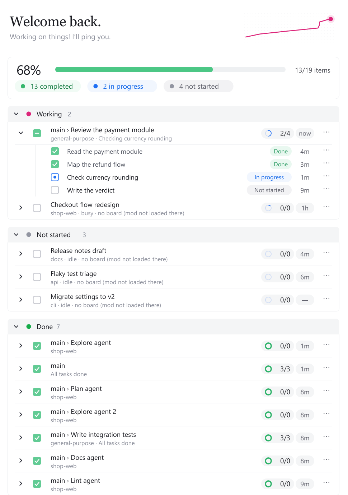

# Agent Track

A live progress board for Claude Code. Every session, every subagent and every todo list on one board, updating as the work happens, in both the terminal and the Claude desktop app.



## What it shows

- **Summary**: overall percent, a progress bar, and how many tasks are completed, in progress and not started. The pills are filters: press one to show only those tasks, or **All** to see everything again.
- **Sections**: Working, Idle and Done, each with a colored dot, done/total and its percent; press anywhere on the header to open or close it. Done starts closed and lists its five latest rows until **Show all**.
- **One row per session or subagent**: its title, what it is doing right now, a progress ring with done/total, and how long ago it last changed. Every running subagent has a row, whether or not it keeps a todo list, and new ones appear within seconds of starting.
- **Tasks** under each row, from the agent's todo list, with a status chip. Press a task (or a row's ⋯) for its details, right under it: its state, when it started or finished, and how long it took.
- **This session, this project, or every session**: the switch at the top right of the Agents summary picks which sessions it shows. **Project** (the default) shows every session working in this project's folder, a folder inside it or one of its worktrees (`.claude/worktrees/`), with each session's running agents, **Session** this one alone, **All** every session on your machine. Each session running Agent Track publishes its board; sessions without it still appear, with their busy or idle state. The choice is remembered for the next session.
- **Project tabs**: your project's own checklists (a roadmap, an art list, anything in Markdown with `- [ ]` boxes) each get a tab before **Agents** (which is always last), in the same design. The tabs sit at the top of the one board pane; click one to switch. See [Project tabs](#project-tabs).

The desktop app gets the full drawing above. The terminal gets the same layout in text and color.

## Requirements

- Claude Code **2.1.285 or newer**. Agent Track is a *mod*: a plugin made of function hooks, which is an early-access Claude Code feature and may change between releases.
- Windows, macOS or Linux.

## Install

### From a marketplace (recommended)

If this folder is published as a Git repository (for example on GitHub), anyone can add it as a marketplace and install from it. In Claude Code:

```
/plugin marketplace add <owner>/<repo>
/plugin install agent-track@agent-track
```

A local copy works the same way: unzip the release and point the marketplace at that folder:

```
/plugin marketplace add C:\path\to\agent-track
/plugin install agent-track@agent-track
```

Claude Code does not refresh a marketplace you added yourself unless you turn that on, so new versions do not show up by themselves. Press **↻ Check updates** above the message box, or turn on **Enable auto-update** for the marketplace under `/plugin` → **Marketplaces**. A marketplace added from a local folder updates only from that folder.

### For one session only

```bash
claude --plugin-dir /path/to/agent-track
```

### For every session, including the desktop app

Add the folder to the `env` block of `~/.claude/settings.json`. The second line makes long-running sessions (the desktop app) reload the mod when its files change:

```json
{
  "env": {
    "CLAUDE_CODE_PLUGIN_DIRS": "/path/to/agent-track",
    "CLAUDE_CODE_PLUGIN_DIR_WATCH": "1"
  }
}
```

Settings are read when a session starts, so reopen sessions that were already running.

## Use

- The board opens by itself the first time an agent writes a todo list or a subagent starts. In the terminal it opens on its own only in windows at least 144 columns wide.
- A **▦ Progress** button sits just above the message box with each tab's live percent; press it to show or hide the board. `/agent-track` does the same at any size. (The desktop app may not list it in its suggestions; type the whole command.)
- **↻ Check updates**, next to it, refreshes the marketplace Agent Track was installed from and updates the plugin when that marketplace has a newer version; `/agent-track update` does the same. After an update it runs `/reload-plugins` itself as soon as Claude is idle, so the new version loads in the same session, and an open board is drawn again by the new version. It runs the `claude` command line, so `claude` must be on your `PATH`.
- A **search field** under each tab's summary filters the tab as you type and highlights what it found. It searches titles, steps, agent types, task descriptions and checklist details; every word must be found, in any case, and words may span a section, a group and an item (`keys second`). ✕ clears it.
- `/agent-track sessions` lists every session Agent Track sees: where it works, whether it publishes a board, and whether the board shows it now.
- Agents that have no built-in todo tool (for example subagents in the desktop app) get one from Agent Track: `mcp__agent-track__todo`. Ask them to use it, or put that in your `CLAUDE.md`, and their tasks show up on the board.

## Project tabs

List the checklist files of a project in `.claude/agent-track.json` in that project's folder. Each one becomes a tab:

```json
{
  "tabs": [
    { "title": "Roadmap", "file": "docs/roadmap.md", "strip": ["\\s*\\(draft\\)"] },
    { "title": "Art", "file": "docs/art-progress.md", "keepEmptySections": true }
  ]
}
```

How a file is read:

- The `#` heading is the tab's title. Each `##` heading is a section; each `###` under it is a group with its own progress ring.
- `- [x]` is done, `- [ ]` is not started, and `- [~]`, `- [-]` or `- [/]` is in progress. Nested boxes count too.
- An item's name is its **bold** part, or its first 70 characters. Press it for the whole line.
- **Part columns**: a line written as `name — part, part` shows its name, then one column per part, each with its own done or not-done mark. A list gets columns when at least half its lines are written that way and one has two parts or more; a part is at most three words (counts in brackets aside), and a **bold** name keeps its own dash (`**HU.5 — The trail.** Tracks…` is a name and a note). A part is not done when it says so (`no art`, `not built`, `missing …`, `(0 props)`) and done otherwise (`art`, `dressed (3 props)`); `art` and `no art` share the `art` column. Columns line up across a whole section; a group's row names each one with its count (`art 18/24`: done of the lines that have that part), and in a narrow pane the counts move to the group's second line.
- `strip` removes text matching these regular expressions from every heading. `keepEmptySections` keeps `##` sections that have no boxes.
- Sections start open unless they are finished; groups start closed. Each section header has its own progress bar.
- **Live matching**: an open item shows *In progress* while something running in the session, or in another session in this project (unless the switch is on **Session**), names the same work: a running agent's label, or a todo item in progress. It matches by task code (`HU.5`, `W.14`) or when one title covers at least 80% of the other (character-pair similarity, no AI). Done items never change, and nothing is written back to the file.

A tab refreshes by itself when its file changes, whether Claude or you edited it. `/agent-track reload` re-reads the list of tabs.

## Settings

| Setting | What it does | Default |
| --- | --- | --- |
| `name` | The name in the greeting: "Welcome back, *name*." | empty ("Welcome back.") |

Change it from Claude Code's config menu, or under `pluginConfigs` in your settings.

## Privacy

Agent Track never sends anything off your machine. To sync sessions it:

- writes each session's board to `~/.claude/agent-track/<session id>.json` (task titles, statuses and times), and
- reads Claude Code's own list of running sessions in `~/.claude/sessions/` (names, folders, busy/idle).

Boards of closed sessions are ignored after 12 hours. Delete `~/.claude/agent-track/` at any time to clear them.

## Uninstall

`/plugin uninstall agent-track@agent-track`, or remove the folder from `CLAUDE_CODE_PLUGIN_DIRS`. Then delete `~/.claude/agent-track/`.

## Develop

```bash
claude plugin validate .
claude plugin test .
```

To type-check, write the engine's types with `/plugin-types .claude/types` in a Claude Code session, then run `tsc -p .`.

`pack.bat` (Windows) validates, tests and packs a release zip into `dist\`.

## License

MIT, see [LICENSE](LICENSE). Made by Kazuki.
