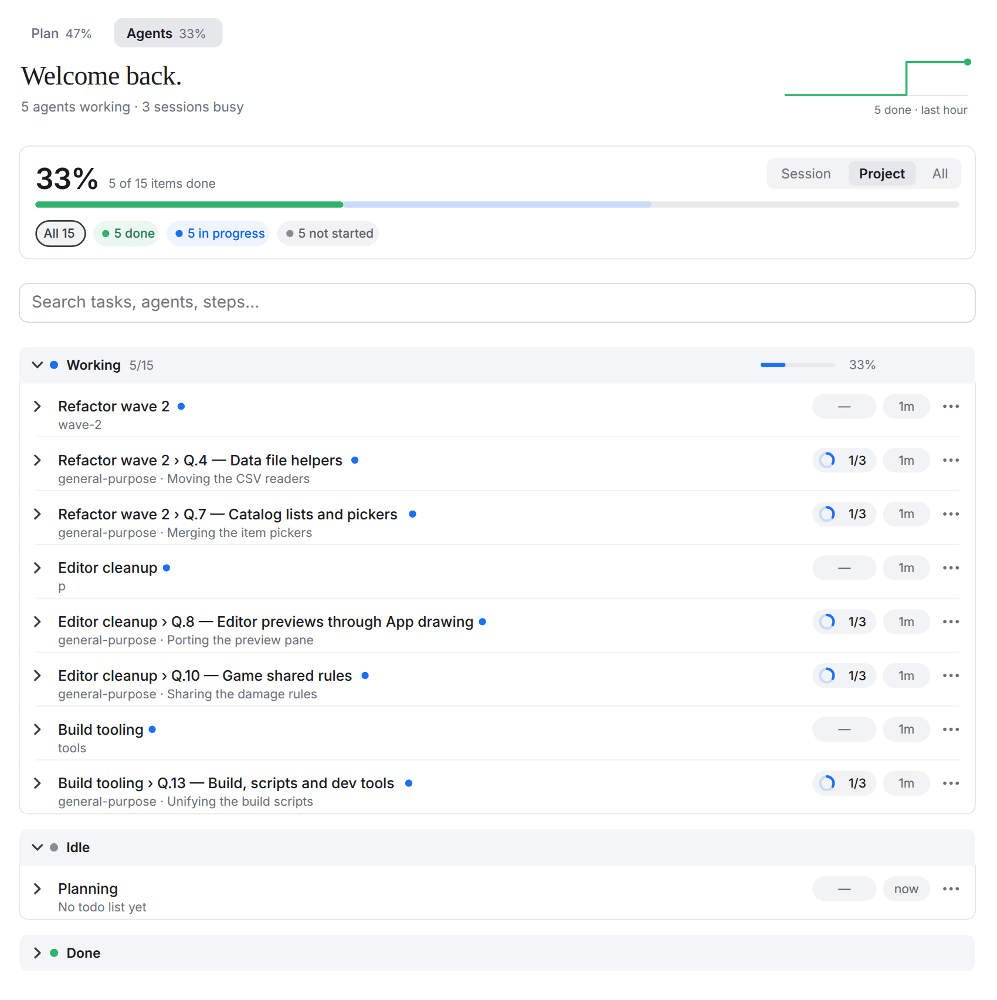
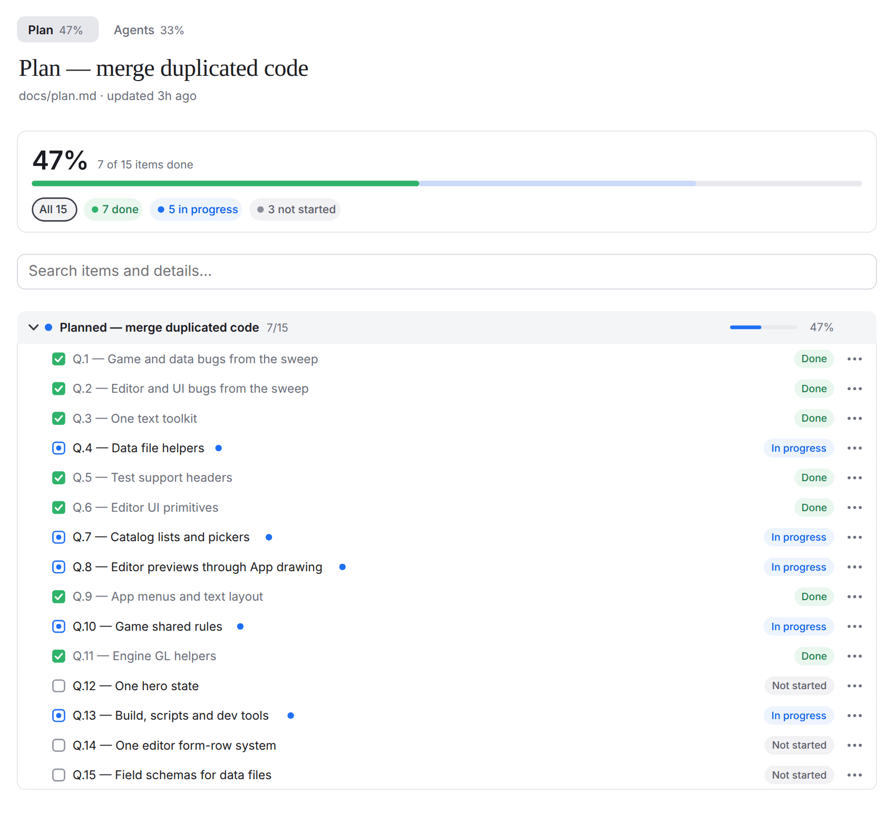
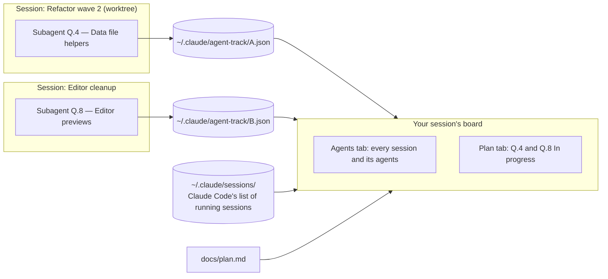

<div align="center">

# Agent Track

**See every Claude Code session working on your project, live.**<br>
Every session, subagent and todo list on one board, and your project's own checklists ticking over to *In progress*<br>while agents in other sessions work on them. In the Claude desktop app and in the terminal.

[](https://github.com/Adhamura/AgentTrack/commits/main)
[](LICENSE)
[](#requirements)

[Quick start](#quick-start) · [Live across sessions](#live-across-sessions) · [How it works](#how-it-works) · [Project checklists](#project-checklists) · [Configuration](#configuration) · [Troubleshooting](#troubleshooting)

</div>

<br>

<picture>
  <source media="(prefers-color-scheme: dark)" srcset="docs/live-agents-dark.png">
  <source media="(prefers-color-scheme: light)" srcset="docs/live-agents.png">
  
</picture>

> [!NOTE]
> Agent Track is a **mod**: a Claude Code plugin made of function hooks. Mods are an early-access Claude Code feature and may change between releases.

## Quick start

In Claude Code:

```
/plugin marketplace add Adhamura/AgentTrack
/plugin install agent-track@agent-track
```

The board opens by itself the first time an agent writes a todo list or a subagent starts (or right away, if the project has [checklist tabs](#project-checklists)). **▦ Progress** above the message box, or `/agent-track`, shows or hides it at any time. If the board doesn't appear, run `/reload-plugins` or start a new session.

### Requirements

- Claude Code **2.1.285 or newer**
- Windows, macOS or Linux

<details>
<summary><b>Other ways to install</b></summary>

<br>

**From a release.** Download `agent-track-<version>.zip` from [Releases](https://github.com/Adhamura/AgentTrack/releases/latest), unzip it (or clone the repository), and point the marketplace at the `agent-track` folder:

```
/plugin marketplace add C:\path\to\agent-track
/plugin install agent-track@agent-track
```

**For one session only:**

```bash
claude --plugin-dir /path/to/agent-track
```

**For every session, including the desktop app,** add the folder to the `env` block of `~/.claude/settings.json`. The second line makes long-running sessions (the desktop app) reload the mod when its files change:

```json
{
  "env": {
    "CLAUDE_CODE_PLUGIN_DIRS": "/path/to/agent-track",
    "CLAUDE_CODE_PLUGIN_DIR_WATCH": "1"
  }
}
```

Settings are read when a session starts, so reopen sessions that were already running.

</details>

## Why

A real project in Claude Code is rarely one conversation. You plan in one session, start a refactor in a second, run a build fix in a worktree, and each of them launches subagents. Their todo lists live in separate transcripts, a subagent without a todo list shows nothing at all, and your roadmap file only changes when someone remembers to tick it.

Agent Track puts all of it on one board, in every session you open: what each session and agent is doing right now, what is next and what is done, and which lines of your plan are being worked on at this moment, wherever that work runs.

## Live across sessions

This is what Agent Track is for. Open the board in any session of a project and you see the work of **every** session in that project, as it happens, without switching windows.

<picture>
  <source media="(prefers-color-scheme: dark)" srcset="docs/live-dark.png">
  <source media="(prefers-color-scheme: light)" srcset="docs/live.png">
  
</picture>

Above, the planning session shows the project's `docs/plan.md`. Nobody has edited that file in 3 hours, yet five lines read *In progress* with a blue live dot: three other sessions (one in a worktree) have subagents named `Q.4 — Data file helpers`, `Q.7 — Catalog lists and pickers` and so on, and the board matched each one to its line. The [image at the top](#agent-track) is the **Agents** tab of the same session: every session of the project, with the subagents it runs and the step each one is on.

- **Every session of the project.** Sessions in the same folder, a folder inside it or one of its worktrees (`.claude/worktrees/<name>`) all count. **Session · Project · All** at the top right of the Agents tab narrows it to this session or widens it to your whole machine.
- **Every agent, todo list or not.** A subagent shows up within seconds of starting, with its type and current step, even one that never writes a todo list or started before Agent Track loaded.
- **Your plan lights up by itself.** A checklist line shows *In progress* while any running agent or in-progress todo item in the project names it: by task code (`Q.4`, `HU.5`) or by most of its title. When the work stops, the line goes back to how the file has it. Nothing is ever written to your files.
- **Always current.** Sessions sync every 2 seconds and the board redraws on its own. Closed sessions drop to **Done** and are forgotten after 12 hours.
- **Nothing to set up.** Install it once; every session that loads it joins in. Sessions without it still appear, busy or idle, with no tasks.

**Tip:** name agents and todo items after your checklist's codes, and ask for it in your `CLAUDE.md` so every session does it:

```markdown
When you start a subagent or a todo item for a line of docs/plan.md,
start its description with that line's code, e.g. "Q.4 — Data file helpers".
```

## Features

<table>
<tr>
<td width="50%" valign="top">
<b>Every session of the project, live</b><br>
The work of every session in this folder, its subfolders and its worktrees, on one board in each of them. <a href="#live-across-sessions">More</a>.
</td>
<td width="50%" valign="top">
<b>Every agent, one board</b><br>
One row per session and subagent: its title, what it is doing right now, a progress ring with done/total, and when it last changed. A subagent gets its row within seconds of starting, todo list or not.
</td>
</tr>
<tr>
<td width="50%" valign="top">
<b>Project checklists as tabs</b><br>
Any Markdown file with <code>- [ ]</code> boxes under <code>##</code> headings, such as a roadmap or an asset list, becomes a tab with sections, groups, progress rings and part columns. It refreshes when the file changes.
</td>
<td width="50%" valign="top">
<b>Your plan lights up</b><br>
A checklist line shows <i>In progress</i>, with a live dot, while an agent in any session of the project works on it.
</td>
</tr>
<tr>
<td width="50%" valign="top">
<b>Search, filters and scope</b><br>
Filter any tab by status, search it as you type, and pick <b>Session</b>, <b>Project</b> or <b>All</b>.
</td>
<td width="50%" valign="top">
<b>Desktop and terminal</b><br>
The desktop app gets a drawn board that fits the pane's width and follows the light or dark theme. The terminal gets the same layout in text and color.
</td>
</tr>
<tr>
<td width="50%" valign="top">
<b>One-click updates</b><br>
<b>↻ Check updates</b> refreshes the marketplace, updates the plugin and reloads it in the same session.
</td>
<td width="50%" valign="top">
<b>Private by design</b><br>
Your boards never leave your machine: they are small JSON files under <code>~/.claude/agent-track/</code>. The only network use is <b>↻ Check updates</b>, which asks Claude Code to fetch the marketplace.
</td>
</tr>
</table>

## Usage

### The board

The board is one pane with a tab per project checklist and **Agents** always last. Click a tab to switch.

- **Opening.** The board opens by itself when a session starts in a project with checklist tabs, and the first time an agent writes a todo list or a subagent starts. In the terminal it opens by itself only in windows at least 144 columns wide (110 once you have opened it yourself); `/agent-track` opens it at any size. If you close it, it stops opening by itself until you open it again.
- **▦ Progress** sits just above the message box with each tab's live percent. Press it to show or hide the board.
- **Summary.** The overall percent, a progress bar, and how many tasks are completed, in progress and not started. On the desktop, the header also charts what got done recently (the last hour on Agents, the last 7 days on a checklist), and Agents greets you by [name](#settings).
- **Filters.** The summary's pills are filters: press one to show only those tasks, or **All** to see everything again.
- **Sections.** Working, Idle and Done, each with a colored dot, done/total and its percent. Press anywhere on a header to open or close it. Done starts closed and lists its five latest rows until **Show all**.
- **Rows and tasks.** Each session or subagent row lists the tasks from its todo list, each with a status chip. Press a task, or a row's **⋯**, for its details right under it: its state, when it started or finished, and how long it took.
- **Scrolling.** Each tab keeps its own scroll position, separately in every session: switch away and back and it opens where you left it, and a live update never moves it.
- **Layout.** On the desktop the board is laid out for the pane's real width: narrow panes drop the time column and part words, never the text size. It follows the app's light or dark theme.

### In the terminal

The terminal gets the same board in text and color: tabs, summary, scope switch, search and sections.


### Search

A search field under each tab's summary filters the tab as you type and highlights what it found. It searches titles, steps, agent types, task descriptions and checklist details. Every word must be found, in any case, and words may span a section, a group and an item (`chapel alms`). **✕** clears it.

### Session scope

The **Session · Project · All** switch at the top right of the Agents summary picks which sessions the board shows:

| Scope | Shows |
| --- | --- |
| **Session** | This session alone. |
| **Project** (default) | Every session working in this project's folder, a folder inside it or one of its worktrees (`.claude/worktrees/`), with each session's running agents. |
| **All** | Every session on your machine. |

Each session running Agent Track publishes its board. Sessions without it still appear, with their busy or idle state. The choice is remembered for the next session. See [How it works](#how-it-works) for how sessions find each other.

### Check updates

**↻ Check updates**, next to ▦ Progress, refreshes the marketplace Agent Track was installed from and updates the plugin when that marketplace offers a newer version. After an update it runs `/reload-plugins` itself as soon as Claude is idle, so the new version loads in the same session, and an open board is drawn again by the new version. It runs the `claude` command line, so `claude` must be on your `PATH`.

A marketplace added from a local folder updates only from that folder. Installed from a folder (`--plugin-dir` or `CLAUDE_CODE_PLUGIN_DIRS`)? Check updates can't update it: pull or replace that folder instead.

### Subagents without a todo tool

Agents that have no built-in todo tool (for example subagents in the desktop app) get one from Agent Track: `mcp__agent-track__todo`. Ask them to use it, or say so in your `CLAUDE.md`, and their tasks show up on the board.

### Commands

| Command | What it does |
| --- | --- |
| `/agent-track` | Shows or hides the board, at any window size. |
| `/agent-track update` | Same as **↻ Check updates**. |
| `/agent-track sessions` | Lists every session Agent Track sees: where it works, whether it publishes a board, and whether the board shows it now. Start here when a session is missing. |
| `/agent-track reload` | Re-reads the list of tabs from `.claude/agent-track.json` and shows the board. |

The desktop app may not list `/agent-track` in its suggestions; type the whole command.

<a id="project-tabs"></a>

## Project checklists

Your project's own checklists, anything in Markdown with `- [ ]` boxes, each get a tab before **Agents**, in the same design. List them in [`.claude/agent-track.json`](#agent-trackjson), or just save them: a Markdown file in the project's folder, `docs/` or `doc/` whose name says it tracks progress (`steam-readiness.md`, `art-progress.md`, `roadmap.md`, `launch-checklist.md`, `todo.md`: the words *progress*, *readiness*, *ready*, *roadmap*, *checklist*, *tracker*, *milestones* or *todo*) and that has at least 5 boxes under `##` headings gets a tab by itself, named after its `#` heading. Plans and notes that only happen to hold boxes stay out. A new file shows up as soon as an agent writes it, or after `/agent-track reload`.

For example, an excerpt of `docs/art-progress.md`:

```markdown
# Art progress

## Act I — The Chapel
### 1.1 Chapel Gate
- [x] cg-entrance — dressed (6 props), art
- [x] cg-bell-tower — dressed (4 props), art
- [ ] cg-alms-vault — not dressed (0 props), no art
- [ ] cg-choir — not built, no art
- [~] cg-sacristy-annex-lower-crypt-passage — dressed (2 props), no art
- [ ] cg-ossuary — not dressed (0 props), no art

## Loose ends
- [ ] Repaint the title card
- [x] Export the palette to the engine
```

The full file (1.1 above, plus more groups and a second act) renders as this tab: one column per part (`dressed`, `art`, `built`, `audio`), a mark per line, and each group's counts on its row.

<picture>
  <source media="(prefers-color-scheme: dark)" srcset="docs/checklist-dark.png">
  <source media="(prefers-color-scheme: light)" srcset="docs/checklist.png">
  
</picture>

### How a file is read

- **Structure.** The `#` heading is the title at the top of the tab (the tab's `title` when there is none). Each `##` heading is a section with its own progress bar; each `###` under it is a group with its own progress ring. **Boxes must sit under a `##` heading:** boxes before the first `##` are not shown. Sections start open unless they are finished; groups start closed.
- **Boxes.** `- [x]` is done, `- [ ]` is not started, and `- [~]`, `- [-]` or `- [/]` is in progress. Nested boxes count too. Both `-` and `*` bullets work, and `[X]` counts as done.
- **Names.** An item's name is its **bold** part, or its first 70 characters. A leading tag in capitals stays a label in front of it: `- [ ] **BLOCKER** Original hero rig…` reads *BLOCKER: Original hero rig…*. Press it for the whole line.
- **Live matching.** An open item shows *In progress*, with a live dot, while something running in this session, or in another session in this project (unless the switch is on **Session**), names the same work: a running agent's label, or a todo item in progress. It matches by task code (`HU.5`, `W.14`) or when one title covers at least 80% of the other (character-pair similarity, no AI). Done items never change, and nothing is written back to the file. A section or group whose title names running work is marked live too. [Step 5 of How it works](#how-it-works) has the exact rules.
- **Refresh.** A tab refreshes by itself when its file changes, whether Claude or you edited it.

### Part columns

A line written as `name — part, part` shows its name, then one column per part, each with its own done or not-done mark.

- A list gets columns when at least half its lines are written that way and one has two parts or more.
- A part is at most three words, counts in brackets aside. A **bold** name keeps its own dash: `**HU.5 — The trail.** Tracks…` is a name and a note.
- A part is not done when it says so (`no art`, `not built`, `missing …`, `(0 props)`) and done otherwise (`art`, `dressed (3 props)`). `art` and `no art` share the `art` column.
- Columns line up across a whole section. A group's row names each one with its count (`art 18/24`: done of the lines that have that part); in a narrow pane the counts move to the group's second line.

## Configuration

### `agent-track.json`

List a project's checklist files in `.claude/agent-track.json` in that project's folder. Each one becomes a tab:

```json
{
  "tabs": [
    { "title": "Roadmap", "file": "docs/roadmap.md", "strip": ["\\s*\\(draft\\)"] },
    { "title": "Art", "file": "docs/art-progress.md", "keepEmptySections": true }
  ]
}
```

| Field | What it does |
| --- | --- |
| `title` | The tab's label in the tab bar. |
| `file` | The Markdown file, relative to the project folder (where the session runs). |
| `strip` | Regular expressions; text matching them is removed from every heading. |
| `keepEmptySections` | Keeps `##` sections that have no boxes. Default `false`. |

At the top level, `"hide": ["docs/feature-progress.md"]` keeps those files from being found, and `"discover": false` turns off the tabs found by shape altogether, so only the listed files show. A tab's file is shown under its title. Listed tabs come first and keep their settings; a found tab opens the board only when you ask for it.

After editing the list, run `/agent-track reload`.

Tabs are read and prepared in the background: each file is read again only when it changes (checked every 3 seconds, and right after an agent edits it), and the board draws only what is ready, so switching tabs never waits. A tab still being prepared shows a turning ring, and a tab whose file just changed says so in green for a few seconds (*Updated from the file · 2 lines changed*). A long checklist (over 40 items) opens only the sections where something is in progress; press a section to open it.

### Settings

| Setting | What it does | Default |
| --- | --- | --- |
| `name` | The name in the greeting: "Welcome back, *name*." | empty ("Welcome back.") |

Change it from Claude Code's config menu (`/config`), or in `~/.claude/settings.json`:

```json
{
  "pluginConfigs": {
    "agent-track@agent-track": { "options": { "name": "Kazuki" } }
  }
}
```

The key is the plugin's id; for a folder install (`--plugin-dir`) it is `agent-track`.

## How it works

Agent Track runs inside each Claude Code session as a mod. Sessions never talk to each other directly: each one writes its own board to a small file on your machine, and reads everyone else's.



1. **Each session keeps its own board.** Agent Track follows the session's events: todo lists (`TodoWrite`, and `mcp__agent-track__todo` for agents without it), `TaskCreate` and `TaskUpdate`, subagents starting and stopping, and turns starting and ending (busy or idle). Every 3 seconds it also reads Claude Code's own list of the session's agents, so a subagent with no todo list still gets a row.
2. **It publishes that board.** Every 2 seconds, when something changed, it writes the board to `~/.claude/agent-track/<session id>.json`: the session's name and folder, each row's title, type and state, and each task's title, status and times.
3. **It reads every other session.** On the same beat it reads Claude Code's registry of running sessions in `~/.claude/sessions/` (every session, with or without Agent Track: its name, folder and busy/idle state) and every published board. A board of a session that is no longer running is kept as finished, and dropped after 12 hours.
4. **It picks the sessions in scope.** **Project** keeps the sessions whose folder is this project's, a folder inside it, or a worktree of it (`<project>/.claude/worktrees/<name>`). **Session** keeps none, **All** keeps every one. Each kept session's rows join the board as *Session › agent*.
5. **It matches running work to your checklists.** It gathers what is running now: this session's running agents and in-progress todo items, and, unless the scope is **Session**, those of the project's other running sessions. An open checklist line is *In progress*, with a live dot, while one of them names the same work:
   - **Same task code.** A code is 1 to 4 letters, a dot and a number (`Q.4`, `HU.5`, `W.14`, `DG.5.2`). When both sides have a code, the codes alone decide: `Q.4` never matches `Q.40`.
   - **Same title.** With no code on one side, the shorter title must cover at least 80% of a stretch of the longer one (character-pair likeness, no AI), and it must be at least two words. A section or group whose title names running work is marked live too.

   Done lines never change, and nothing is written back to the file: when the work stops, the line shows what the file says again.
6. **It draws in the background.** Files are read only when they change (every 3 seconds, and right after an agent edits one), prepared off the drawing path, and drawn once ready, so the board stays responsive while agents work.

**Privacy.** Your boards never leave your machine, and Agent Track makes no network calls of its own (↻ Check updates asks Claude Code to refresh the marketplace from where you installed it). It writes only `~/.claude/agent-track/<session id>.json` and reads `~/.claude/sessions/`. Delete `~/.claude/agent-track/` at any time to clear the boards. (Paths are under `$CLAUDE_CONFIG_DIR` when you set it.)

**Limits.**
- A session shows its agents and tasks only when Agent Track is loaded in it; reload or restart sessions that were open before you installed or updated it.
- Matching sees what agents are *named* and the todo items they write, not what they do; name them after the work (see the [tip](#live-across-sessions)).
- Sessions on other machines are not seen: the sync is through files in your own `~/.claude`.

## Troubleshooting

<details>
<summary><b>A new version doesn't show up</b></summary>

<br>

Claude Code does not refresh a marketplace you added yourself unless you turn that on, so new versions do not appear by themselves. Press **↻ Check updates** above the message box (or run `/agent-track update`), or turn on **Enable auto-update** for the marketplace under `/plugin` → **Marketplaces**. Installed from a folder? See [Check updates](#check-updates).

</details>

<details>
<summary><b>The board doesn't open or draw</b></summary>

<br>

- See [Opening](#the-board) for when it opens by itself. `/agent-track` opens it at any size.
- If a tab shows an error instead of the board, press **▦ Progress** twice to close and reopen it.
- A tab that says *Can't read docs/x.md*: `file` is relative to the folder the session runs in; fix the path and run `/agent-track reload`.
- Installed through `CLAUDE_CODE_PLUGIN_DIRS`? Settings are read when a session starts, so reopen sessions that were already running.

</details>

<details>
<summary><b>A session or subagent is missing</b></summary>

<br>

- Run `/agent-track sessions` ([Commands](#commands)).
- Check the [scope switch](#session-scope).
- A session's tasks appear only when Agent Track is loaded in that session too; without it the session shows only as busy or idle.
- A subagent with no tasks may have no todo tool: see [Subagents without a todo tool](#subagents-without-a-todo-tool).

</details>

## Uninstall

`/plugin uninstall agent-track@agent-track`, or remove the folder from `CLAUDE_CODE_PLUGIN_DIRS`. Then delete `~/.claude/agent-track/`.

## Development

```bash
claude plugin validate .
claude plugin validate .claude-plugin/plugin.json
tsc -p .
claude plugin test .
node scripts/check-version.mjs origin/main
```

`tsc` needs the engine's types in `.claude/types/claude-code.d.ts` (git-ignored): write them with `/plugin-types .claude/types` in a Claude Code session. Every change to what the plugin ships (`hooks/`, `types/`, `.claude-plugin/`) raises the version in both `.claude-plugin/plugin.json` and `.claude-plugin/marketplace.json`; see [CLAUDE.md](CLAUDE.md). `node scripts/pack.mjs` (any platform) or `pack.bat` (Windows, which also validates and tests) packs a release zip into `dist/`. Releases publish themselves: when a new version reaches `main`, the Release workflow tags it `v<version>` and attaches the zip, with notes listing the pull requests since the last release.

## License

[MIT](LICENSE). Made by Kazuki.
