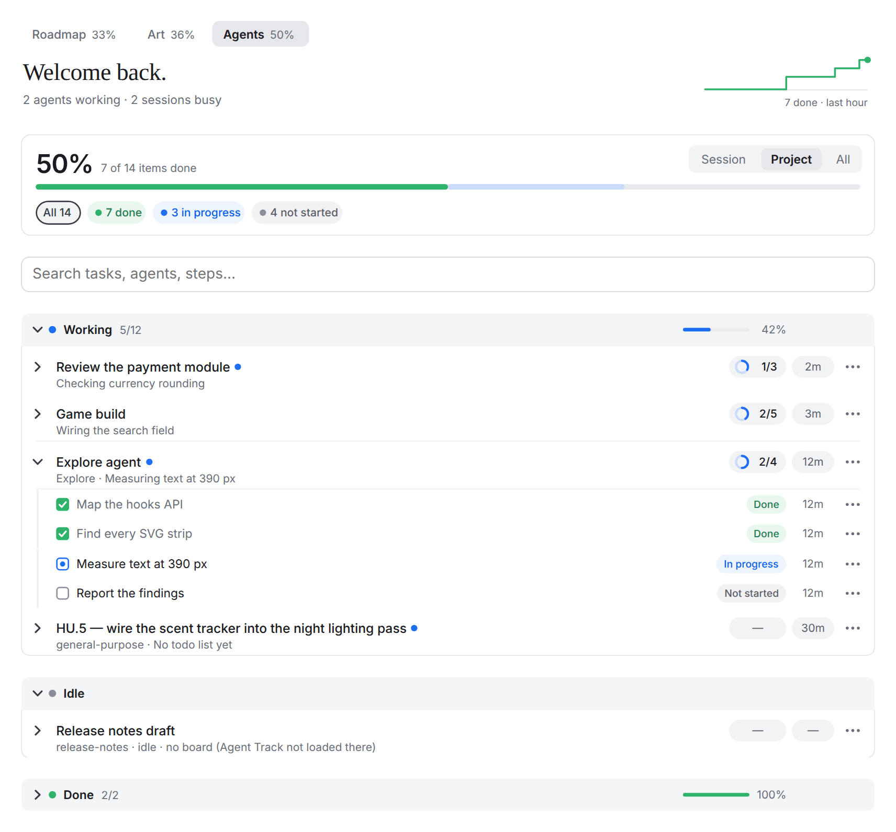
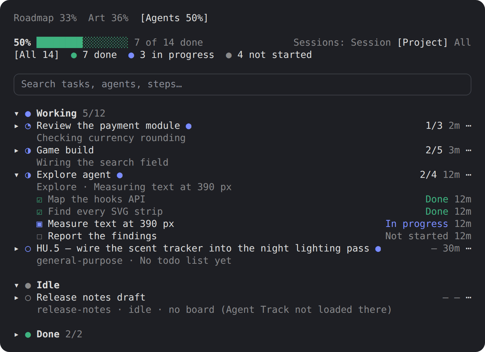
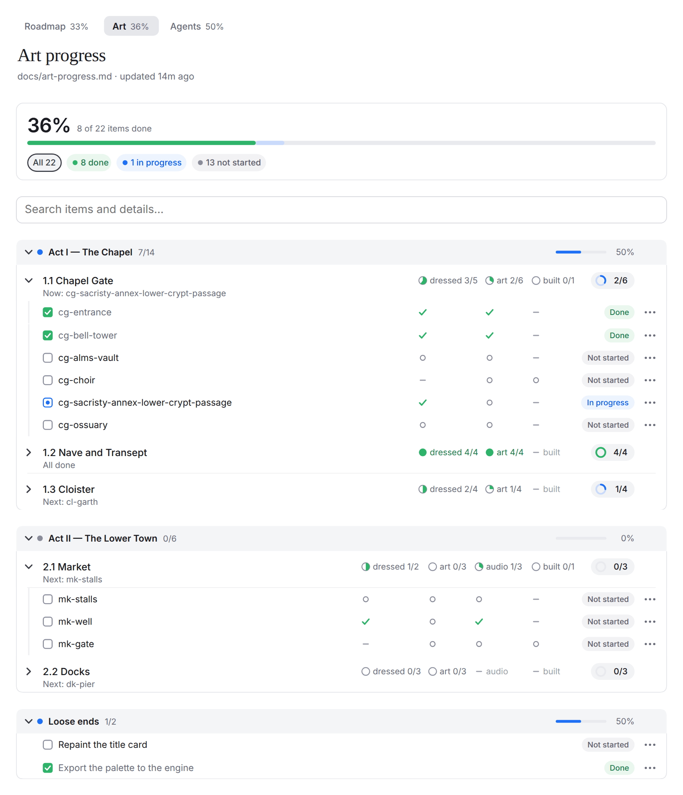

<div align="center">

# Agent Track

**A live progress board for Claude Code.**<br>
Every session, subagent, todo list and project checklist on one board, updating as the work happens,<br>in the Claude desktop app and in the terminal.

[](https://github.com/Adhamura/AgentTrack/commits/main)
[](LICENSE)
[](#requirements)

[Quick start](#quick-start) · [Usage](#usage) · [Project checklists](#project-checklists) · [Configuration](#configuration) · [Troubleshooting](#troubleshooting)

</div>

<br>

<picture>
  <source media="(prefers-color-scheme: dark)" srcset="docs/agents-dark.png">
  <source media="(prefers-color-scheme: light)" srcset="docs/agents.png">
  
</picture>

> [!NOTE]
> Agent Track is a **mod**: a Claude Code plugin made of function hooks. Mods are an early-access Claude Code feature and may change between releases.

## Quick start

In Claude Code:

```
/plugin marketplace add Adhamura/AgentTrack
/plugin install agent-track@agent-track
```

The board opens by itself the first time an agent writes a todo list or a subagent starts (or right away, if the project has [checklist tabs](#project-checklists)). **▦ Progress** above the message box, or `/agent-track`, shows or hides it at any time. If the board doesn't appear, run `/reload-plugins` or start a new session.

### Requirements

- Claude Code **2.1.285 or newer**
- Windows, macOS or Linux

<details>
<summary><b>Other ways to install</b></summary>

<br>

**From a local copy.** Clone the repository (or **Code → Download ZIP** and unzip it) and point the marketplace at that folder:

```
/plugin marketplace add C:\path\to\agent-track
/plugin install agent-track@agent-track
```

**For one session only:**

```bash
claude --plugin-dir /path/to/agent-track
```

**For every session, including the desktop app,** add the folder to the `env` block of `~/.claude/settings.json`. The second line makes long-running sessions (the desktop app) reload the mod when its files change:

```json
{
  "env": {
    "CLAUDE_CODE_PLUGIN_DIRS": "/path/to/agent-track",
    "CLAUDE_CODE_PLUGIN_DIR_WATCH": "1"
  }
}
```

Settings are read when a session starts, so reopen sessions that were already running.

</details>

## Why

Claude Code often runs several things at once: a main session, a few subagents, maybe a second session in a worktree. Their todo lists live in separate transcripts, and a subagent without a todo list shows nothing at all. Agent Track gathers all of it on one board, so you can see at a glance what is running, what is next and what is done, without scrolling back through any of them.

## Features

<table>
<tr>
<td width="50%" valign="top">
<b>Every agent, one board</b><br>
One row per session and subagent: its title, what it is doing right now, a progress ring with done/total, and when it last changed. A subagent gets its row within seconds of starting, todo list or not.
</td>
<td width="50%" valign="top">
<b>This session, this project, or all</b><br>
A switch picks the scope. <b>Project</b> (the default) covers every session in this folder, a folder inside it or one of its worktrees. Sessions sync live, on your machine.
</td>
</tr>
<tr>
<td width="50%" valign="top">
<b>Project checklists as tabs</b><br>
Any Markdown file with <code>- [ ]</code> boxes under <code>##</code> headings, such as a roadmap or an asset list, becomes a tab with sections, groups, progress rings and part columns. It refreshes when the file changes.
</td>
<td width="50%" valign="top">
<b>Live matching</b><br>
An open checklist item shows <i>In progress</i> while a running agent or todo item names the same work.
</td>
</tr>
<tr>
<td width="50%" valign="top">
<b>Search and filters</b><br>
Filter any tab by status, or search it as you type.
</td>
<td width="50%" valign="top">
<b>Desktop and terminal</b><br>
The desktop app gets a drawn board that fits the pane's width and follows the light or dark theme. The terminal gets the same layout in text and color.
</td>
</tr>
<tr>
<td width="50%" valign="top">
<b>One-click updates</b><br>
<b>↻ Check updates</b> refreshes the marketplace, updates the plugin and reloads it in the same session.
</td>
<td width="50%" valign="top">
<b>Private by design</b><br>
Your boards never leave your machine: they are small JSON files under <code>~/.claude/agent-track/</code>. The only network use is <b>↻ Check updates</b>, which asks Claude Code to fetch the marketplace.
</td>
</tr>
</table>

## Usage

### The board

The board is one pane with a tab per project checklist and **Agents** always last. Click a tab to switch.

- **Opening.** The board opens by itself when a session starts in a project with checklist tabs, and the first time an agent writes a todo list or a subagent starts. In the terminal it opens by itself only in windows at least 144 columns wide (110 once you have opened it yourself); `/agent-track` opens it at any size. If you close it, it stops opening by itself until you open it again.
- **▦ Progress** sits just above the message box with each tab's live percent. Press it to show or hide the board.
- **Summary.** The overall percent, a progress bar, and how many tasks are completed, in progress and not started. On the desktop, the header also charts what got done recently (the last hour on Agents, the last 7 days on a checklist), and Agents greets you by [name](#settings).
- **Filters.** The summary's pills are filters: press one to show only those tasks, or **All** to see everything again.
- **Sections.** Working, Idle and Done, each with a colored dot, done/total and its percent. Press anywhere on a header to open or close it. Done starts closed and lists its five latest rows until **Show all**.
- **Rows and tasks.** Each session or subagent row lists the tasks from its todo list, each with a status chip. Press a task, or a row's **⋯**, for its details right under it: its state, when it started or finished, and how long it took.
- **Layout.** On the desktop the board is laid out for the pane's real width: narrow panes drop the time column and part words, never the text size. It follows the app's light or dark theme.

### In the terminal

The terminal gets the same board in text and color: tabs, summary, scope switch, search and sections.



### Search

A search field under each tab's summary filters the tab as you type and highlights what it found. It searches titles, steps, agent types, task descriptions and checklist details. Every word must be found, in any case, and words may span a section, a group and an item (`chapel alms`). **✕** clears it.

### Session scope

The **Session · Project · All** switch at the top right of the Agents summary picks which sessions the board shows:

| Scope | Shows |
| --- | --- |
| **Session** | This session alone. |
| **Project** (default) | Every session working in this project's folder, a folder inside it or one of its worktrees (`.claude/worktrees/`), with each session's running agents. |
| **All** | Every session on your machine. |

Each session running Agent Track publishes its board. Sessions without it still appear, with their busy or idle state. The choice is remembered for the next session.

### Check updates

**↻ Check updates**, next to ▦ Progress, refreshes the marketplace Agent Track was installed from and updates the plugin when that marketplace offers a newer version. After an update it runs `/reload-plugins` itself as soon as Claude is idle, so the new version loads in the same session, and an open board is drawn again by the new version. It runs the `claude` command line, so `claude` must be on your `PATH`.

A marketplace added from a local folder updates only from that folder. Installed from a folder (`--plugin-dir` or `CLAUDE_CODE_PLUGIN_DIRS`)? Check updates can't update it: pull or replace that folder instead.

### Subagents without a todo tool

Agents that have no built-in todo tool (for example subagents in the desktop app) get one from Agent Track: `mcp__agent-track__todo`. Ask them to use it, or say so in your `CLAUDE.md`, and their tasks show up on the board.

### Commands

| Command | What it does |
| --- | --- |
| `/agent-track` | Shows or hides the board, at any window size. |
| `/agent-track update` | Same as **↻ Check updates**. |
| `/agent-track sessions` | Lists every session Agent Track sees: where it works, whether it publishes a board, and whether the board shows it now. Start here when a session is missing. |
| `/agent-track reload` | Re-reads the list of tabs from `.claude/agent-track.json` and shows the board. |

The desktop app may not list `/agent-track` in its suggestions; type the whole command.

<a id="project-tabs"></a>

## Project checklists

Your project's own checklists, anything in Markdown with `- [ ]` boxes, each get a tab before **Agents**, in the same design. List them in [`.claude/agent-track.json`](#agent-trackjson).

For example, an excerpt of `docs/art-progress.md`:

```markdown
# Art progress

## Act I — The Chapel
### 1.1 Chapel Gate
- [x] cg-entrance — dressed (6 props), art
- [x] cg-bell-tower — dressed (4 props), art
- [ ] cg-alms-vault — not dressed (0 props), no art
- [ ] cg-choir — not built, no art
- [~] cg-sacristy-annex-lower-crypt-passage — dressed (2 props), no art
- [ ] cg-ossuary — not dressed (0 props), no art

## Loose ends
- [ ] Repaint the title card
- [x] Export the palette to the engine
```

The full file (1.1 above, plus more groups and a second act) renders as this tab: one column per part (`dressed`, `art`, `built`, `audio`), a mark per line, and each group's counts on its row.

<picture>
  <source media="(prefers-color-scheme: dark)" srcset="docs/checklist-dark.png">
  <source media="(prefers-color-scheme: light)" srcset="docs/checklist.png">
  
</picture>

### How a file is read

- **Structure.** The `#` heading is the title at the top of the tab (the tab's `title` when there is none). Each `##` heading is a section with its own progress bar; each `###` under it is a group with its own progress ring. **Boxes must sit under a `##` heading:** boxes before the first `##` are not shown. Sections start open unless they are finished; groups start closed.
- **Boxes.** `- [x]` is done, `- [ ]` is not started, and `- [~]`, `- [-]` or `- [/]` is in progress. Nested boxes count too. Both `-` and `*` bullets work, and `[X]` counts as done.
- **Names.** An item's name is its **bold** part, or its first 70 characters. Press it for the whole line.
- **Live matching.** An open item shows *In progress* while something running in this session, or in another session in this project (unless the switch is on **Session**), names the same work: a running agent's label, or a todo item in progress. It matches by task code (`HU.5`, `W.14`) or when one title covers at least 80% of the other (character-pair similarity, no AI). Done items never change, and nothing is written back to the file. A section or group whose title names running work is marked live too.
- **Refresh.** A tab refreshes by itself when its file changes, whether Claude or you edited it.

### Part columns

A line written as `name — part, part` shows its name, then one column per part, each with its own done or not-done mark.

- A list gets columns when at least half its lines are written that way and one has two parts or more.
- A part is at most three words, counts in brackets aside. A **bold** name keeps its own dash: `**HU.5 — The trail.** Tracks…` is a name and a note.
- A part is not done when it says so (`no art`, `not built`, `missing …`, `(0 props)`) and done otherwise (`art`, `dressed (3 props)`). `art` and `no art` share the `art` column.
- Columns line up across a whole section. A group's row names each one with its count (`art 18/24`: done of the lines that have that part); in a narrow pane the counts move to the group's second line.

## Configuration

### `agent-track.json`

List a project's checklist files in `.claude/agent-track.json` in that project's folder. Each one becomes a tab:

```json
{
  "tabs": [
    { "title": "Roadmap", "file": "docs/roadmap.md", "strip": ["\\s*\\(draft\\)"] },
    { "title": "Art", "file": "docs/art-progress.md", "keepEmptySections": true }
  ]
}
```

| Field | What it does |
| --- | --- |
| `title` | The tab's label in the tab bar. |
| `file` | The Markdown file, relative to the project folder (where the session runs). |
| `strip` | Regular expressions; text matching them is removed from every heading. |
| `keepEmptySections` | Keeps `##` sections that have no boxes. Default `false`. |

After editing the list, run `/agent-track reload`.

### Settings

| Setting | What it does | Default |
| --- | --- | --- |
| `name` | The name in the greeting: "Welcome back, *name*." | empty ("Welcome back.") |

Change it from Claude Code's config menu (`/config`), or in `~/.claude/settings.json`:

```json
{
  "pluginConfigs": {
    "agent-track@agent-track": { "options": { "name": "Kazuki" } }
  }
}
```

The key is the plugin's id; for a folder install (`--plugin-dir`) it is `agent-track`.

## How it works

Agent Track listens to Claude Code's own events (todo writes, task tools, subagents starting and stopping, turns ending) and keeps a board for the session. Every couple of seconds each session publishes its board and reads the others', which is how the **Project** and **All** scopes see work in other sessions.

**Privacy.** Your boards never leave your machine, and Agent Track makes no network calls of its own (↻ Check updates asks Claude Code to refresh the marketplace from where you installed it). To sync sessions it:

- writes each session's board to `~/.claude/agent-track/<session id>.json` (task titles, statuses and times), and
- reads Claude Code's own list of running sessions in `~/.claude/sessions/` (names, folders, busy/idle).

Boards of closed sessions are ignored after 12 hours. Delete `~/.claude/agent-track/` at any time to clear them. (Paths are under `$CLAUDE_CONFIG_DIR` when you set it.)

## Troubleshooting

<details>
<summary><b>A new version doesn't show up</b></summary>

<br>

Claude Code does not refresh a marketplace you added yourself unless you turn that on, so new versions do not appear by themselves. Press **↻ Check updates** above the message box (or run `/agent-track update`), or turn on **Enable auto-update** for the marketplace under `/plugin` → **Marketplaces**. Installed from a folder? See [Check updates](#check-updates).

</details>

<details>
<summary><b>The board doesn't open or draw</b></summary>

<br>

- See [Opening](#the-board) for when it opens by itself. `/agent-track` opens it at any size.
- If a tab shows an error instead of the board, press **▦ Progress** twice to close and reopen it.
- A tab that says *Can't read docs/x.md*: `file` is relative to the folder the session runs in; fix the path and run `/agent-track reload`.
- Installed through `CLAUDE_CODE_PLUGIN_DIRS`? Settings are read when a session starts, so reopen sessions that were already running.

</details>

<details>
<summary><b>A session or subagent is missing</b></summary>

<br>

- Run `/agent-track sessions` ([Commands](#commands)).
- Check the [scope switch](#session-scope).
- A session's tasks appear only when Agent Track is loaded in that session too; without it the session shows only as busy or idle.
- A subagent with no tasks may have no todo tool: see [Subagents without a todo tool](#subagents-without-a-todo-tool).

</details>

## Uninstall

`/plugin uninstall agent-track@agent-track`, or remove the folder from `CLAUDE_CODE_PLUGIN_DIRS`. Then delete `~/.claude/agent-track/`.

## Development

```bash
claude plugin validate .
claude plugin validate .claude-plugin/plugin.json
tsc -p .
claude plugin test .
node scripts/check-version.mjs origin/main
```

`tsc` needs the engine's types in `.claude/types/claude-code.d.ts` (git-ignored): write them with `/plugin-types .claude/types` in a Claude Code session. Every change to what the plugin ships (`hooks/`, `types/`, `.claude-plugin/`) raises the version in both `.claude-plugin/plugin.json` and `.claude-plugin/marketplace.json`; see [CLAUDE.md](CLAUDE.md). `pack.bat` (Windows) validates, tests and packs a release zip into `dist\`.

## License

[MIT](LICENSE). Made by Kazuki.
